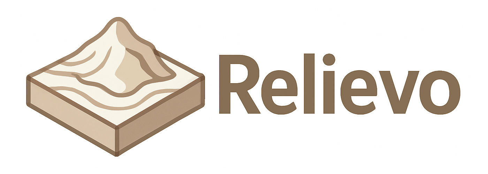

# Relievo - 3D Terrain Model Generator

**Relievo** is a Python tool for generating watertight 3D terrain models 
from DEM (Digital Elevation Model) tiles and user-defined geographic regions. 
It supports topographic mesh generation, vertical exaggeration, 
side walls and base extrusion, and optional tiling for large-scale output.

STL files can be exported directly for 3D printing or scientific visualization.

---

## Features

- Load and merge multiple GeoTIFF DEM tiles
- Define regions via bounding box, Shapely polygon, or GeoJSON
- Project to metric CRS (e.g., UTM)
- Generate topography, base, and vertical walls
- Control resolution, scaling, and exaggeration
- Export STL files (single or tiled)

---

## Installation

### 1. Clone the repository

```bash
git clone https://github.com/yourname/relievo.git
cd relievo
```

### 2. Install required dependencies

```bash
pip install numpy rasterio shapely pyproj trimesh scipy
```

### 3. (Optional) Install in editable mode

```bash
pip install -e .
```

If you use `pyproject.toml` and want to build the package:

```bash
python -m build
```

---

## Basic Usage

Import the main function:

```python
from relievo import relievo
```

---

### 1. Bounding Box Mode

```python
relievo(
    tif_paths=[
        "data/N045E012.tif",
        "data/N045E013.tif"
    ],
    geometry=[12.3, 13.9, 45.6, 46.7],  # lon_min, lon_max, lat_min, lat_max
    resolution_m=100,
    base_depth=-1000.0,
    xy_scale=1/700,
    vertical_exaggeration=2.0,
    out_prefix="output/relief_box"
)
```

---

### 2. GeoJSON Mode (with property filtering)

```python
relievo(
    tif_paths="data/",
    geometry="data/regions.geojson",
    property_key="reg_code",
    property_value="6",  # Select region by attribute
    resolution_m=100,
    base_depth=-1000.0,
    xy_scale=1/700,
    vertical_exaggeration=2.0,
    out_prefix="output/relief_region"
)
```

---

### 3. Tiled Output Mode

```python
relievo(
    tif_paths="data/",
    geometry="data/test_polygon.geojson",
    resolution_m=100,
    base_depth=-1000.0,
    xy_scale=1/700,
    vertical_exaggeration=2.0,
    tile_size_m=50000,
    out_prefix="output/relief_tiled"
)
```

This will generate multiple STL files:

```
output/relief_tiled_0_0.stl
output/relief_tiled_0_1.stl
output/relief_tiled_1_0.stl
...
```

---

## License

This project is licensed under the GNU AGPL v3.0.

---

## Author

Valerio Poggi  
Istituto Nazionale di Oceanografia e di Geofisica Sperimentale (OGS)  
vpoggi@ogs.it
